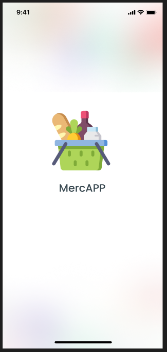

# Mercapp - Aplicativo para Supermercado

## 📌 Descrição do Projeto
O **Mercapp** é um aplicativo desenvolvido para melhorar a experiência de compra em supermercados, oferecendo funcionalidades intuitivas para clientes e ferramentas de gestão para administradores. O projeto inclui também um plano de marketing estratégico para o lançamento e promoção do aplicativo.

**Objetivo:**  
Facilitar as compras dos clientes, otimizar operações do supermercado e fortalecer o relacionamento com os consumidores por meio de um aplicativo moderno e eficiente.

---

## Backlog Completo:
*https://github.com/pedro-fs-garcia/MercApp/blob/main/backlog.md*
---
### Listagem de todas as User Stories:
## Resumo das USs:

US01 - `Como equipe de design, eu quero criar um protótipo do aplicativo no Figma, para validar a experiência do usuário antes do desenvolvimento.`   

US02 - `Como cliente, eu quero me cadastrar no aplicativo usando meu e-mail ou número de telefone, para acessar funcionalidades personalizadas.`  

US03 - `Como cliente, eu quero visualizar a lista de produtos disponíveis no supermercado, para escolher o que desejo comprar.`  

US04 - `Como administrador, eu quero cadastrar produtos no sistema, para mantê-los atualizados no aplicativo.`  

US05 - `Como cliente, eu quero adicionar produtos ao carrinho de compras, para finalizar minha compra posteriormente`  

US06 - `Como cliente, eu quero filtrar produtos por categoria, preço ou promoções, para encontrar o que preciso mais rapidamente.`  

US07 - `Como cliente, eu quero finalizar minha compra com opções de pagamento e entrega, para receber meus produtos em casa.`  

US08 - `Como cliente, eu quero receber notificações sobre promoções e ofertas personalizadas, para economizar em minhas compras.`  

US09 - `Como cliente, eu quero avaliar o aplicativo após a efetuação de um pedido.`  

US010 - `Como administrador, eu quero integrar o aplicativo com o sistema de estoque do supermercado, para garantir que os produtos estejam sempre atualizados.`  

US011 - `Como administrador, eu quero visualizar relatórios de vendas e desempenho do aplicativo.`  

US012 - `Como equipe de marketing, eu quero criar campanhas promocionais no aplicativo.`  

US013 - `Como administrador, eu quero publicar o aplicativo nas lojas oficiais.`  

US014 - `Como equipe de marketing, eu quero executar o plano de lançamento.`  

US015 - `Como cliente, eu quero enviar feedback sobre minha experiência.`  

---

## Protótipo Figma:

*https://www.figma.com/design/BMOEbkzvhoEZDUjeKZurKB/MercApp---prototipo?t=yrkrjfr7K85waKSq-0*
---
## 🚀 Funcionalidades Principais

### Para Clientes:
- **Cadastro de Usuário**  
  Registro via e-mail ou número de telefone com verificação.  
- **Listagem e Busca de Produtos**  
  Organização por categorias, filtros por preço e promoções.  
- **Carrinho de Compras**  
  Adição de produtos e finalização de pedido com múltiplas opções de pagamento (cartão, PIX, dinheiro).  
- **Programa de Fidelidade**  
  Acúmulo de pontos por compras e resgate de benefícios.  
- **Avaliação de Produtos**  
  Sistema de avaliações e comentários para compartilhar opiniões.  
- **Notificações Personalizadas**  
  Alertas sobre promoções e ofertas baseadas no histórico de compras.  

### Para Administradores:
- **Cadastro e Gestão de Produtos**  
  Inclusão, edição e sincronização com o estoque em tempo real.  
- **Relatórios de Vendas**  
  Métricas de desempenho e engajamento dos usuários.  
- **Campanhas Promocionais**  
  Criação de banners, cupons e acompanhamento de resultados.  

---

## 📋 Backlog do Produto (Resumido)

### Sprint 1: Base do Aplicativo
- Protótipo das telas no Figma.
- Cadastro de usuário.
- Listagem de produtos.
- Cadastro de produtos (admin).

### Sprint 2: Compra e Navegação
- Carrinho de compras.
- Filtros e ordenação de produtos.
- Finalização de pedido.

### Sprint 3: Experiência do Cliente
- Notificações personalizadas.
- Avaliação de produtos.
- Programa de fidelidade.

### Sprint 4: Integrações e Marketing
- Integração com sistema de estoque.
- Relatórios de vendas.
- Campanhas promocionais.

### Sprint 5: Lançamento
- Coleta de feedback.
- Publicação nas lojas (Google Play e App Store).
- Execução do plano de marketing.

---

## 🛠 Tecnologias Utilizadas
- **Frontend:** React Native (para aplicativo móvel) ou Flutter.  
- **Backend:** Node.js com Express ou Django.  
- **Banco de Dados:** Firebase Realtime Database ou PostgreSQL.  
- **Design:** Figma (protótipos e UI/UX).  
- **Integrações:** APIs de pagamento (ex: Stripe, Mercado Pago) e serviços de SMS (ex: Twilio).  

---

## 📅 Plano de Marketing (Destaques)
- **Campanhas Online:**  
  - Redes sociais (Instagram, Facebook).  
  - E-mail marketing com cupons de desconto.  
- **Parcerias:**  
  - Influenciadores locais.  
  - Promoções em colaboração com marcas.  
- **Lançamento:**  
  - Evento presencial com degustações e descontos exclusivos.  

---

**📌 Status do Projeto:** Em desenvolvimento (Previsão de lançamento: [data]).  
